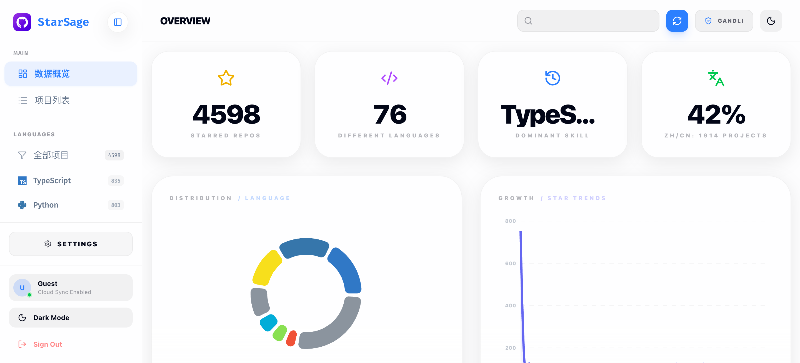

<p align="center">
  
  <h1 align="center">StarSage</h1>
</p>

<p align="center">
  <a href="https://github.com/gandli/StarSage/actions/workflows/deploy.yml">
    
  </a>
</p>

<p align="center">
  <strong>StarSage</strong> 是一款专为 GitHub 极客打造的高性能、多用户星标仓库管理面板。通过极致的渲染性能、智能化的信息整理和多用户协作，让您的 GitHub 知识库焕发新生。
</p>



## ✨ 核心特性

- **🚀 极致性能引擎**:
  - **原生主题联动**: CSS 变量驱动，零闪烁深浅色切换。
  - **并发渲染优化**: 基于 React 19 并发模式，万级数据操作如丝般顺滑。
  - **闪电级存取**: IndexedDB 本地缓存 + Supabase 云端同步，秒级加载。

- **👥 多用户协作架构**:
  - **独立星标管理**: 每个人拥有独立的星标列表，互不干扰。
  - **共享翻译池**: 仓库描述翻译全局共享，一次翻译，全员受益。
  - **智能数据隔离**: 基于 RLS (Row Level Security) 的数据安全隔离。

- **🧠 智能化增强**:
  - **中文化洞察**: 实时统计翻译覆盖率，一目了然。
  - **闲时自动翻译**: 利用浏览器空闲时间自动翻译未翻译的仓库描述。
  - **多维自动分类**: 自动提取技术栈、Topics 及 Star 增长趋势。
  - **状态上下文持久化**: 刷新页面不丢失任何分页、搜索及过滤视图进度。

- **🎨 视觉美学**:
  - **Premium UI**: 深度打磨的 Glassmorphism（磨砂玻璃）质感。
  - **全响应式**: 针对移动端深度优化的交互体验。
  - **数据可视化**: 集成 Recharts 动态图表，直观展示数据分布。

## 🛠️ 技术栈

- **框架**: [React 19](https://react.dev/) + [Vite 7](https://vitejs.dev/)
- **样式**: [Tailwind CSS 4](https://tailwindcss.com/)
- **动画**: [Framer Motion](https://www.framer.com/motion/)
- **后端**: [Supabase](https://supabase.com/) (PostgreSQL + RLS)
- **存储**: IndexedDB (离线优先)
- **测试**: [Vitest](https://vitest.dev/)

## ⚡ 快速开始

### 前置要求

- [Bun](https://bun.sh/) (推荐) 或 Node.js
- Supabase 账号

### 1. 克隆项目

```bash
git clone https://github.com/gandli/StarSage.git
cd StarSage
```

### 2. 安装依赖

```bash
bun install
```

### 3. 配置环境变量

复制示例文件并填写配置：

```bash
cp .env.example .env
```

编辑 `.env`：

```env
VITE_SUPABASE_URL=your_supabase_project_url
VITE_SUPABASE_ANON_KEY=your_supabase_anon_key

# (可选) Cloudflare Workers AI 翻译配置
VITE_CF_ACCOUNT_ID=your_cloudflare_account_id
VITE_CF_API_TOKEN=your_cloudflare_api_token
```

### 4. 初始化 Supabase

1. 登录 Supabase 并创建新项目。
2. 进入项目的 **SQL Editor**。
3. 执行数据库迁移脚本以创建表结构和 RLS 策略：
   - 脚本路径：`supabase/migrations/20260118_multi_user_schema.sql`
   - 或者直接复制该文件内容到 SQL Editor 执行。

> ⚠️ **现有用户注意**: 如果您是从旧版本升级，请务必参考 [MIGRATION_GUIDE.md](MIGRATION_GUIDE.md) 进行数据迁移，否则可能导致数据不可见。

### 5. 启动开发服务器

```bash
bun dev
```
访问 <http://localhost:5173> 即可开启您的 StarSage 之旅 🎉

### 6. 配置 GitHub OAuth (推荐)

为获得最佳体验（如访问私有仓库、更高的 API 速率限制），建议配置 GitHub OAuth：

1. 在 [GitHub Developer Settings](https://github.com/settings/developers) 创建 OAuth App。
2. 将回调 URL 设置为 `https://<your-project-id>.supabase.co/auth/v1/callback`。
3. 在 Supabase Dashboard -> Authentication -> Providers 中启用 GitHub，并填入 Client ID 和 Client Secret。

## 🧪 开发与测试

本项目使用 Vitest 进行单元测试和 UI 测试。

```bash
# 运行单元测试
bun test

# 启动可视化测试界面
bun run test:ui

# 生成测试覆盖率报告
bun run test:coverage
```

## 🏗️ 构建与部署

### 构建生产版本

```bash
bun run build
# 预览构建结果
bun preview
```

### 部署选项

- **GitHub Pages**: 项目已配置 Actions，推送到 `main` 分支即可自动部署。
- **Cloudflare Pages** (推荐):
  ```bash
  bun run build
  wrangler pages deploy dist --project-name=starsage
  ```
- **Vercel / Netlify**: 导入仓库并配置 `VITE_SUPABASE_URL` 和 `VITE_SUPABASE_ANON_KEY` 环境变量即可。

## 🔧 项目结构

```
StarSage/
├── src/
│   ├── components/     # UI 组件 (Header, Sidebar, RepoList 等)
│   ├── hooks/          # 自定义 Hooks (useGithubSync, useAuth 等)
│   ├── lib/            # 第三方库配置 (Supabase)
│   ├── utils/          # 核心工具函数 (DB, Markdown, Translate)
│   ├── workers/        # Web Workers (后台数据处理)
│   ├── App.tsx         # 根组件
│   └── main.tsx        # 入口文件
├── supabase/
│   └── migrations/     # 数据库迁移 SQL 脚本
├── tests/              # 测试文件
├── public/             # 静态资源
└── dist/               # 构建产物
```

## 🤝 贡献指南

欢迎提交 Issue 和 Pull Request！请确保您的代码通过了所有测试，并遵循项目的代码规范。

1. Fork 本仓库
2. 创建特性分支 (`git checkout -b feature/AmazingFeature`)
3. 提交更改 (`git commit -m 'Add some AmazingFeature'`)
4. 推送到分支 (`git push origin feature/AmazingFeature`)
5. 开启 Pull Request

## 📝 许可证

本项目采用 [MIT](LICENSE) 许可证。

## 💬 联系方式

- 提交 [Issue](https://github.com/gandli/StarSage/issues)
- 发起 [Discussion](https://github.com/gandli/StarSage/discussions)

## ⭐ Star History

[](https://star-history.com/#gandli/StarSage&Date)
