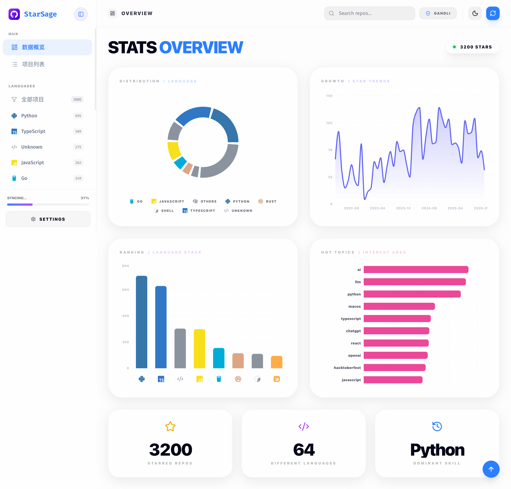

# StarSage 🌟

[](https://github.com/gandli/StarSage/actions/workflows/deploy.yml)

> **StarSage** 是一款专为 GitHub 极客打造的高性能、高美学星标仓库管理面板。



## 💎 核心愿景

StarSage 不仅仅是一个仓库列表,它致力于通过极致的渲染性能和智能化的信息整理,让您的 GitHub 知识库焕发新生。

## ✨ 核心特性

- **🚀 极致性能引擎**:
  - 全量迁移至 **CSS 变量驱动** 的主题系统,实现零闪烁、秒级切换。
  - 深度集成 React 19 的 `useTransition` 特性,确保交互响应永不卡顿。
  - 使用 **IndexedDB** 承载 4000+ 仓库数据的本地秒开体验。
- **🧠 智能化增强**:
  - **多维分类**: 自动分类技术栈、热点话题及星标增长趋势。
  - **自适应布局**: 根据 Topics 标签状态动态调整卡片高度,信息呈现率提升 100%。

- **视觉美学控制**:
  - 精美的 **Glassmorphism** 磨砂玻璃质感 UI。
  - 完整的 **Devicon** 编程语言图标库集成,高度对齐品牌色彩。
  - 响应式图表系统,多维度洞察您的代码品味。

## 🛠️ 技术栈

- **框架**: [React 19](https://react.dev/) + [Vite 7](https://vitejs.dev/)
- **样式**: [Tailwind CSS 4](https://tailwindcss.com/)
- **动画**: [Framer Motion](https://www.framer.com/motion/)
- **后端**: [Supabase](https://supabase.com/) (认证 + 数据库)
- **本地存储**: IndexedDB (离线优先)
- **图标**: [Devicon](https://devicon.dev/) + [Lucide React](https://lucide.dev/)
- **可视化**: [Recharts](https://recharts.org/)

## ⚡ 快速开始

### 1. 克隆项目

```bash
git clone https://github.com/gandli/StarSage.git
cd StarSage
```

### 2. 安装依赖

推荐使用 [Bun](https://bun.sh/) 作为包管理器:

```bash
bun install
```

或使用 npm/pnpm:

```bash
npm install
# 或
pnpm install
```

### 3. 配置环境变量

创建 `.env` 文件并配置 Supabase 连接信息:

```bash
cp .env.example .env
```

编辑 `.env` 文件:

```env
VITE_SUPABASE_URL=your_supabase_project_url
VITE_SUPABASE_ANON_KEY=your_supabase_anon_key

# 可选:Cloudflare Workers AI 翻译
VITE_CF_ACCOUNT_ID=your_cloudflare_account_id
VITE_CF_API_TOKEN=your_cloudflare_api_token
```

> 💡 **Cloudflare 翻译 (可选)**: 配置后可自动将英文描述批量翻译为中文,提升 20 倍性能。

#### 📌 获取 Supabase 配置

1. 访问 [Supabase](https://supabase.com/) 并创建账号
2. 创建新项目 (选择离你最近的区域,如 `ap-southeast-1`)
3. 在项目设置中找到 **API** 部分:
   - **Project URL** → 复制到 `VITE_SUPABASE_URL`
   - **anon public** key → 复制到 `VITE_SUPABASE_ANON_KEY`

#### 📌 创建数据库表

在 Supabase 控制台的 **SQL Editor** 中执行以下 SQL:

```sql
-- 创建 repos 表用于存储 GitHub stars 数据
CREATE TABLE IF NOT EXISTS repos (
    id BIGINT PRIMARY KEY,
    user_id UUID NOT NULL REFERENCES auth.users(id) ON DELETE CASCADE,
    name TEXT NOT NULL,
    full_name TEXT NOT NULL,
    html_url TEXT NOT NULL,
    stargazers_count INTEGER,
    updated_at TIMESTAMP WITH TIME ZONE,
    topics TEXT[],
    language TEXT,
    description TEXT,
    starred_at TIMESTAMP WITH TIME ZONE,
    owner JSONB,
    synced_at TIMESTAMP WITH TIME ZONE DEFAULT NOW(),
    created_at TIMESTAMP WITH TIME ZONE DEFAULT NOW()
);

-- 创建索引以提高查询性能
CREATE INDEX IF NOT EXISTS idx_repos_user_id ON repos(user_id);
CREATE INDEX IF NOT EXISTS idx_repos_starred_at ON repos(starred_at DESC);
CREATE INDEX IF NOT EXISTS idx_repos_language ON repos(language);

-- 启用行级安全策略 (RLS)
ALTER TABLE repos ENABLE ROW LEVEL SECURITY;

-- 创建安全策略:用户只能访问自己的数据
CREATE POLICY "Users can view their own repos"
    ON repos FOR SELECT
    USING (auth.uid() = user_id);

CREATE POLICY "Users can insert their own repos"
    ON repos FOR INSERT
    WITH CHECK (auth.uid() = user_id);

CREATE POLICY "Users can update their own repos"
    ON repos FOR UPDATE
    USING (auth.uid() = user_id);

CREATE POLICY "Users can delete their own repos"
    ON repos FOR DELETE
    USING (auth.uid() = user_id);
```

### 4. 配置 GitHub OAuth (可选但推荐)

使用 GitHub OAuth 可以获得更好的体验:

1. 访问 [GitHub Developer Settings](https://github.com/settings/developers)
2. 点击 **New OAuth App** 创建应用:
   - **Application name**: `StarSage`
   - **Homepage URL**: `http://localhost:5173`
   - **Authorization callback URL**: `https://your-project-id.supabase.co/auth/v1/callback`

     > 💡 将 `your-project-id` 替换为你的 Supabase 项目 ID

3. 复制 **Client ID** 和 **Client Secret**

4. 在 Supabase 控制台配置:
   - 进入 **Authentication** → **Providers**
   - 找到 **GitHub** 并启用
   - 填入 Client ID 和 Client Secret
   - 保存配置

### 5. 启动开发服务器

```bash
bun dev
```

应用将在 <http://localhost:5173> 启动 🎉

### 6. 首次使用指南

#### 步骤 1: 注册/登录

- **推荐**: 使用 GitHub OAuth 登录(一键授权)
- **备选**: 使用邮箱注册账号

#### 步骤 2: 配置 GitHub 数据源

登录后,应用会提示你配置 GitHub 数据源。有两种方式:

**方式 1: GitHub Personal Access Token (推荐)**

1. 访问 [GitHub Tokens](https://github.com/settings/tokens)
2. 点击 **Generate new token** → **Generate new token (classic)**
3. 配置 token:
   - **Note**: `StarSage`
   - **Expiration**: 选择有效期
   - **Scopes**: 勾选 `public_repo` (或 `repo` 如果需要访问私有 stars)
4. 生成并复制 token
5. 在 StarSage 设置中:
   - 选择 **Token** 模式
   - 粘贴 token
   - 保存

**优点**:

- ✅ 可以访问私有 stars
- ✅ API 速率限制更高 (5000 次/小时)
- ✅ 更快的同步速度

**方式 2: GitHub 用户名**

1. 在 StarSage 设置中:
   - 选择 **Username** 模式
   - 输入你的 GitHub 用户名
   - 保存

**优点**:

- ✅ 无需创建 token,更简单
- ❌ 只能访问公开 stars
- ❌ API 速率限制较低 (60 次/小时)

#### 步骤 3: 同步数据

配置完成后,应用会自动开始同步你的 GitHub stars:

1. **首次同步**: 可能需要几分钟(取决于 star 数量)
2. **进度显示**: 侧边栏会显示同步进度
3. **数据存储**:
   - 本地: IndexedDB (离线访问)
   - 云端: Supabase (多设备同步)
4. **增量更新**: 后续会自动检测新 stars,只同步变更

## 🏗️ 构建生产版本

```bash
bun run build
```

构建产物将输出到 `dist/` 目录。

预览构建结果:

```bash
bun preview
```

## 🚀 部署

### 部署到 GitHub Pages

项目已配置 GitHub Actions 自动部署:

1. Fork 本仓库
2. 在仓库 **Settings** → **Pages** 中:
   - Source: 选择 `gh-pages` 分支
   - 保存
3. 在仓库 **Settings** → **Secrets and variables** → **Actions** 中添加:
   - `VITE_SUPABASE_URL`: 你的 Supabase URL
   - `VITE_SUPABASE_ANON_KEY`: 你的 Supabase Anon Key
4. 推送代码到 `main` 分支,自动触发部署

### 部署到 Vercel

[](https://vercel.com/new/clone?repository-url=https://github.com/gandli/StarSage)

1. 点击上方按钮
2. 配置环境变量:
   - `VITE_SUPABASE_URL`
   - `VITE_SUPABASE_ANON_KEY`
3. 点击 Deploy

### 部署到 Netlify

```bash
# 安装 Netlify CLI
npm install -g netlify-cli

# 构建并部署
bun run build
netlify deploy --prod --dir=dist
```

## 📊 功能特性

### 数据管理

- **离线优先**: 使用 IndexedDB 本地存储,支持离线访问
- **云端同步**: 自动同步到 Supabase,多设备数据一致
- **增量更新**: 智能检测新 stars,只同步变更数据
- **自动翻译**: 异步翻译英文描述为中文(MyMemory API)

### 数据可视化

- **语言分布**: 饼图展示你最常用的编程语言
- **Star 趋势**: 时间轴展示你的 star 历史
- **热门话题**: 统计最常见的 topics 标签
- **仓库列表**: 支持搜索、筛选、分页

### 性能优化

- **分页加载**: 每页 30 条,可自定义
- **懒加载**: 图表组件按需加载
- **缓存策略**: 智能缓存减少 API 调用
- **主题切换**: 零闪烁的暗色/亮色模式
- **React 19**: 使用 useTransition 保持 UI 响应

## 🔧 技术架构

```
StarSage/
├── src/
│   ├── components/     # React 组件
│   │   ├── AuthScreen.tsx
│   │   ├── Charts.tsx
│   │   ├── Header.tsx
│   │   ├── RepoList.tsx
│   │   ├── Sidebar.tsx
│   │   └── SettingsModal.tsx
│   ├── hooks/          # 自定义 Hooks
│   │   ├── useAuth.ts
│   │   ├── useGithubSync.ts
│   │   └── useProfile.ts
│   ├── lib/            # 第三方库配置
│   │   └── supabase.ts
│   ├── utils/          # 工具函数
│   │   └── db.ts       # IndexedDB 封装
│   ├── types/          # TypeScript 类型
│   │   └── index.ts
│   ├── App.tsx         # 主应用
│   └── main.tsx        # 入口文件
├── public/             # 静态资源
├── dist/               # 构建输出
└── .github/
    └── workflows/
        └── deploy.yml  # GitHub Actions 配置
```

### 数据流

```
GitHub API
    ↓
useGithubSync Hook
    ↓
IndexedDB (本地) + Supabase (云端)
    ↓
React State
    ↓
UI Components
```

## 🤝 贡献指南

欢迎提交 Issue 和 Pull Request!

1. Fork 本仓库
2. 创建特性分支 (`git checkout -b feature/AmazingFeature`)
3. 提交更改 (`git commit -m 'Add some AmazingFeature'`)
4. 推送到分支 (`git push origin feature/AmazingFeature`)
5. 开启 Pull Request

### 开发规范

- 使用 TypeScript
- 遵循 ESLint 规则
- 组件使用函数式组件 + Hooks
- 提交信息遵循 [Conventional Commits](https://www.conventionalcommits.org/)

## 📅 更新日志

详情请参阅 [CHANGELOG.md](CHANGELOG.md)。

## 📝 许可证

本项目采用 MIT 许可证。详见 [LICENSE](LICENSE) 文件。

## 💬 联系方式

如有问题或建议,欢迎通过以下方式联系:

- 提交 [Issue](https://github.com/gandli/StarSage/issues)
- 发起 [Discussion](https://github.com/gandli/StarSage/discussions)

## ⭐ Star History

如果这个项目对你有帮助,欢迎给个 Star ⭐

---

Designed with ❤️ for Open Source Lovers.
